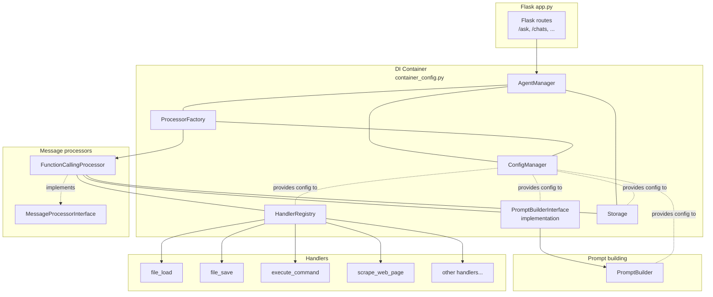

# Architecture overview

This document connects the main pieces of the system:

- HTTP endpoints (`app.py`)
- DI container (`container_config.py`)
- Message processors (`src/message_processors/…`)
- Handlers (`src/handlers/…`)
- Storage and conversations (`src/storage/…`)
- Prompt building (`src/prompt_builders/…`)
- Ask request flow (`src/message_endpoints/ask_request_handler.py`)
- OpenAI API helper (`src/api_helpers.py`)

…and shows how they work together.

## Documentation map

For deeper dives into specific areas, see:

- [`storage.md`](./storage.md) – storage layer, chat sessions, messages, and how conversations are stored and identified.
- [`prompt_builder.md`](./prompt_builder.md) – how prompts are built from agent config, chat history, contexts, and external documents.
- [`ask_request_handler.md`](./ask_request_handler.md) – `/ask` endpoint flow, session creation, friendly names, and interaction with processors.
- [`handlers.md`](./handlers.md) – tool/handler architecture and how processors invoke them.
- [`message_processors.md`](./message_processors.md) – message processor types and how they orchestrate model calls and tools.
- [`request_endpoints.md`](./request_endpoints.md) – HTTP endpoints and high-level request/response flow.

## 1. Request → Processor → Handlers

At a high level, a typical request flows like this:

1. **Entry**  
   - HTTP: `/ask` endpoint in `app.py` → `AskRequestHandler.handle(payload)`  
   - CLI: `main.py` → constructs payload → `AskRequestHandler.handle(payload)`

2. **Session setup**  
   `AskRequestHandler`:
   - Normalizes names (`account_name`, `agent_name`, etc.).
   - Ensures a `ChatSession` exists in storage (creates one if needed).
   - Decides the canonical `conversation_id` (UUID) and optional `friendly_name`.

3. **Processing**  
   `FunctionCallingProcessor.process_message(...)`:
   - Builds a prompt via `PromptBuilder.build_prompt(...)`.
   - Calls `openai_call(...)` in a loop (tool calls, etc.).
   - Appends messages to storage.

4. **Response**  
   - `AskRequestHandler` returns `{ ok, answer, conversation_id, ... }`.
   - CLI or web client prints/displays `answer`.

### DI wiring overview (Mermaid)

This diagram shows:

- `app.py` only knows about `AgentManager` (resolved from the DI container).
- `AgentManager` depends on `ConfigManager`, `ProcessorFactory`, and `Storage`.
- `ProcessorFactory` uses `ConfigManager` and constructs concrete `MessageProcessor` implementations (e.g. `FunctionCallingProcessor`).
- `FunctionCallingProcessor` depends on:
  - `PromptBuilderInterface` implementation (`PromptBuilder`).
  - `HandlerRegistry`.
  - `Storage`.
- `PromptBuilder` depends on:
  - `AgentManager` (agent config, system prompts, personas).
  - `Storage` (chat history, documents).
  - `ContextManager` (named contexts).

See also:

- [`storage.md`](./storage.md) – storage and conversation model.
- [`prompt_builder.md`](./prompt_builder.md) – prompt building from agent config, history, contexts, and documents.
- [`handlers.md`](./handlers.md) – details on handlers/tools.
- [`message_processors.md`](./message_processors.md) – details on message processors.
- [`request_endpoints.md`](./request_endpoints.md) – HTTP endpoints and request flow.
- [`ask_request_handler.md`](./ask_request_handler.md) – `/ask` request lifecycle.

## 2. Prompt building and storage

Prompt building is a key integration point between the model and storage.

- The `/ask` handler ensures there is a valid `conversation_id` backed by a `ChatSession` in storage.
- Message processors call `PromptBuilder.build_prompt(...)` with:
  - `content_text` – current user message.
  - `conversation_id` – storage-backed session id.
  - `agent_name`, `account_name` – to load agent config and account-specific data.
  - `context_type`, `context_name` – to control inclusion of named contexts and external documents.
- `PromptBuilder` then:
  - Builds a base system message from agent config (system prompt, persona, style).
  - Optionally adds extra system messages from the processor.
  - Loads recent chat history from storage (`ChatSession.messages`) and appends it.
  - Loads named context via `ContextManager` (backed by storage) and appends it as a system message.
  - Optionally loads relevant external documents (e.g., Obsidian notes) via `get_document_context(storage=...)` and appends a summarized system message.
  - Appends the current user message and ensures it is the last message.

For more detail, see [`prompt_builder.md`](./prompt_builder.md).

## 3. Logging and error handling (request path)

To make debugging easier and avoid "silent" failures, the typical `/ask` (or CLI) path has explicit logging and error handling at each stage.

### 3.1 `/ask` handler

- Logs each request with:
  - `account_name`, `agent_name`.
  - `context_name`, `select_type` (context type).
  - Incoming `conversation_id` (if any).
  - Resolved storage-backed `session_id`.
  - `friendly_name` when a new session is created.
- On errors:
  - Logs a stack trace with account, agent, session id, and a short preview of the message.
  - Returns a generic 500 error payload to the client (details are in logs).

### 3.2 `FunctionCallingProcessor`

- Logs at the start of processing:
  - Account, agent, `session_id`.
  - `context_type` and `max_function_call_iterations`.
- For each OpenAI call (via `openai_call`):
  - Logs model name, number of messages, last role, and a short preview of the last message.
- When tools are used:
  - Logs each tool-call iteration with iteration number, max iterations, agent, session id, and tool count.
  - Logs an error if `max_function_call_iterations` is exceeded and returns a clear message to the user.
- On unexpected errors inside the processor:
  - Logs a stack trace with agent and session id.
  - Appends the inbound user message and an assistant error message to the conversation in storage (with `metadata.error = True`).
  - Exits the process with a non-zero status so you do not keep running in a bad state.

### 3.3 `PromptBuilder`

- Logs a summary for each prompt:
  - Agent, account, `session_id`.
  - `context_type` and `context_name`.
  - Number of history messages included.
  - Number of document snippets included.
- On storage/context/document issues:
  - If the chat session cannot be loaded, logs a warning and builds the prompt without history.
  - If a named context cannot be loaded or is missing, logs a warning and continues without that context.
  - If document context loading fails, logs a warning and continues without documents.

### 3.4 OpenAI API helper (`api_helpers.py`)

- For each OpenAI call:
  - Logs a concise summary (model, message count, last role, preview).
  - Optionally logs detailed request/response payloads when debug env vars are set:
    - `LUCY_OPENAI_DEBUG=1` – request/response summaries.
    - `LUCY_OPENAI_DEBUG_FULL=1` – full JSON dumps.
- On errors:
  - For 400/`BadRequestError`, logs the error, response body, and tool names, then re-raises.
  - For retryable errors (rate limits, timeouts, transient API errors):
    - Logs the error and backs off with exponential delay.
    - Logs when retries are exhausted and re-raises.
  - For unexpected exceptions, logs a stack trace and re-raises.

These logs, combined with stored conversations (including error messages), make it much easier to trace what happened for any given request and where it failed.
