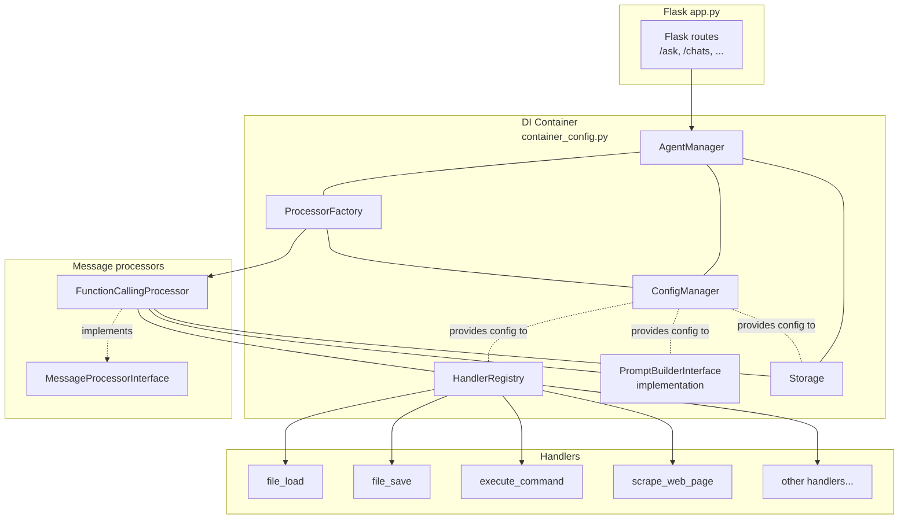

# Architecture overview

This document connects the main pieces of the system:

- HTTP endpoints (`app.py`)
- DI container (`container_config.py`)
- Message processors (`src/message_processors/…`)
- Handlers (`src/handlers/…`)

…and shows how they work together.

## 1. Request → Processor → Handlers

(Existing prose description of the flow should be here; this update adds a DI-focused diagram.)

### DI wiring overview (Mermaid)

This diagram shows:

- `app.py` only knows about `AgentManager` (resolved from the DI container).
- `AgentManager` depends on `ConfigManager`, `ProcessorFactory`, and `Storage`.
- `ProcessorFactory` uses `ConfigManager` and constructs concrete `MessageProcessor` implementations (e.g. `FunctionCallingProcessor`).
- `FunctionCallingProcessor` depends on:
  - `PromptBuilderInterface` implementation
  - `HandlerRegistry`
  - `Storage`
- `HandlerRegistry` knows about all handler classes and uses `ConfigManager` when instantiating them.

See also:

- [`handlers.md`](./handlers.md) – details on handlers/tools.
- [`message_processors.md`](./message_processors.md) – details on message processors.
- [`request_endpoints.md`](./request_endpoints.md) – HTTP endpoints and request flow.
