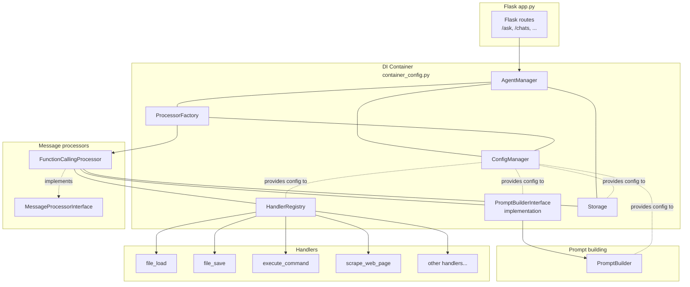

# Architecture overview

This document connects the main pieces of the system:

- HTTP endpoints (`app.py`)
- DI container (`container_config.py`)
- Message processors (`src/message_processors/…`)
- Handlers (`src/handlers/…`)
- Storage and conversations (`src/storage/…`)
- Prompt building (`src/prompt_builders/…`)
- Ask request flow (`src/message_endpoints/ask_request_handler.py`)

…and shows how they work together.

## Documentation map

For deeper dives into specific areas, see:

- [`storage.md`](./storage.md) – storage layer, chat sessions, messages, and how conversations are stored and identified.
- [`prompt_builder.md`](./prompt_builder.md) – how prompts are built from agent config, chat history, contexts, and external documents.
- [`ask_request_handler.md`](./ask_request_handler.md) – `/ask` endpoint flow, session creation, friendly names, and interaction with processors.
- [`handlers.md`](./handlers.md) – tool/handler architecture and how processors invoke them.
- [`message_processors.md`](./message_processors.md) – message processor types and how they orchestrate model calls and tools.
- [`request_endpoints.md`](./request_endpoints.md) – HTTP endpoints and high-level request/response flow.

## 1. Request → Processor → Handlers

(Existing prose description of the flow should be here; this update adds a DI-focused diagram.)

### DI wiring overview (Mermaid)

This diagram shows:

- `app.py` only knows about `AgentManager` (resolved from the DI container).
- `AgentManager` depends on `ConfigManager`, `ProcessorFactory`, and `Storage`.
- `ProcessorFactory` uses `ConfigManager` and constructs concrete `MessageProcessor` implementations (e.g. `FunctionCallingProcessor`).
- `FunctionCallingProcessor` depends on:
  - `PromptBuilderInterface` implementation (`PromptBuilder`)
  - `HandlerRegistry`
  - `Storage`
- `PromptBuilder` depends on:
  - `AgentManager` (agent config, system prompts, personas)
  - `Storage` (chat history, documents)
  - `ContextManager` (named contexts)

See also:

- [`storage.md`](./storage.md) – storage and conversation model.
- [`prompt_builder.md`](./prompt_builder.md) – prompt building from agent config, history, contexts, and documents.
- [`handlers.md`](./handlers.md) – details on handlers/tools.
- [`message_processors.md`](./message_processors.md) – details on message processors.
- [`request_endpoints.md`](./request_endpoints.md) – HTTP endpoints and request flow.
- [`ask_request_handler.md`](./ask_request_handler.md) – `/ask` request lifecycle.

## 2. Prompt building and storage

Prompt building is a key integration point between the model and storage.

- The `/ask` handler ensures there is a valid `conversation_id` backed by a `ChatSession` in storage.
- Message processors call `PromptBuilder.build_prompt(...)` with:
  - `content_text` – current user message.
  - `conversation_id` – storage-backed session id.
  - `agent_name`, `account_name` – to load agent config and account-specific data.
  - `context_type`, `context_name` – to control inclusion of named contexts and external documents.
- `PromptBuilder` then:
  - Builds a base system message from agent config (system prompt, persona, style).
  - Optionally adds extra system messages from the processor.
  - Loads recent chat history from storage (`ChatSession.messages`) and appends it.
  - Loads named context via `ContextManager` (backed by storage) and appends it as a system message.
  - Optionally loads relevant external documents (e.g., Obsidian notes) via `get_document_context(storage=...)` and appends a summarized system message.
  - Appends the current user message and ensures it is the last message.

For more detail, see [`prompt_builder.md`](./prompt_builder.md).
