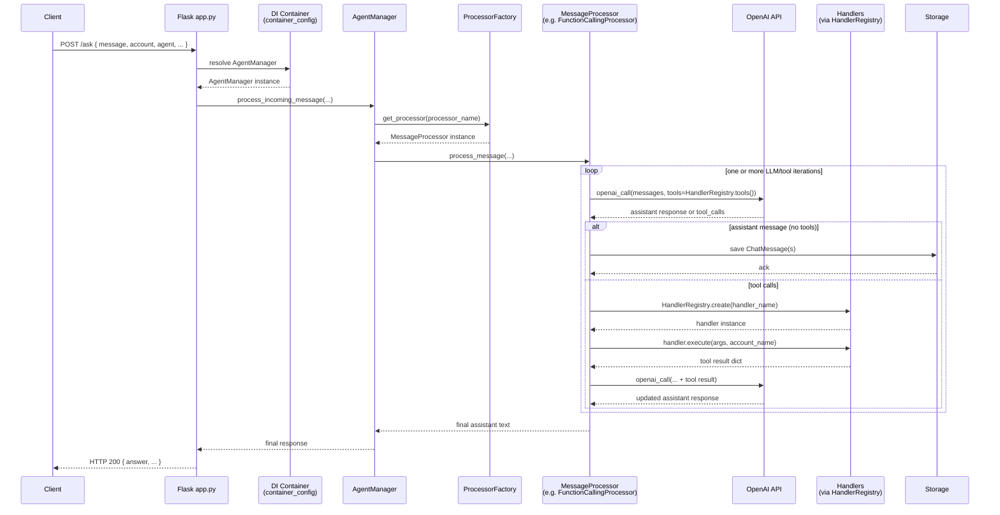

# Request endpoints and DI overview

## Sequence diagram for `/ask`

(Other explanatory text omitted here for brevity; this file should already contain the prose description you requested earlier, with this diagram appended.)
